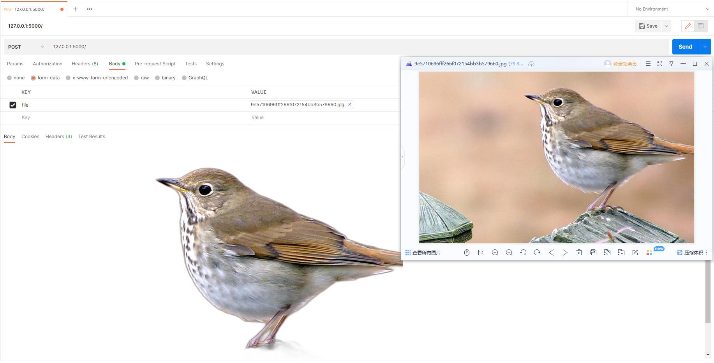

# 自动抠图工具

构建

```
docker build -t rembg:1.0.0 .
//或者
docker-compose build
```

安装

```
docker run -d -p 5000:5000 --name rembg rembg:1.0.0
//或者
docker-compose up -d
```

可以访问以下页面查看接口文档，了解接口调用方式

http://localhost:5000/docs

使用示例



参考开源项目

1. https://github.com/danielgatis/rembg